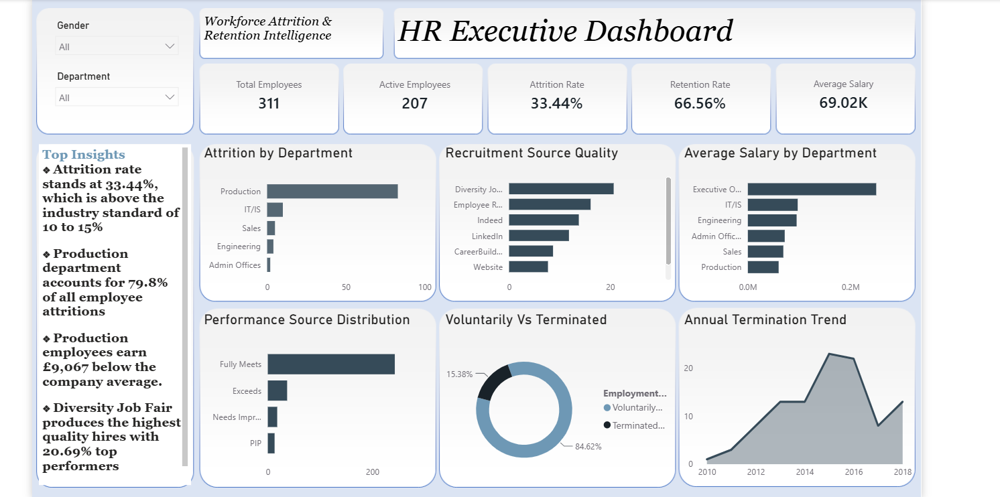
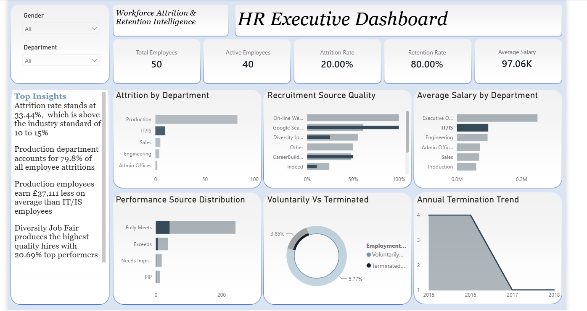

# Employee Attrition Analysis
## HR Executive Dashboard — Workforce Attrition and Retention Intelligence

## Project Overview
This project analyses a Human Resources dataset containing 
311 employee records across multiple departments and states 
spanning from 2006 to 2018. Using MySQL for data cleaning 
and analysis and Power BI for visualisation, the goal is 
to uncover meaningful insights about employee attrition, 
performance and satisfaction that support data-driven 
HR decision making.

## Business Problem
The organisation is experiencing a 33.44% employee attrition 
rate more than double the industry standard of 10-15%. 
HR teams lack visibility into the key drivers behind this 
turnover making it difficult to implement effective 
retention strategies.

The analysis focused on answering the following questions:
- What is the overall employee attrition and retention rate?
- Which department has the highest attrition rate?
- Does salary affect attrition?
- Which recruitment source produces the best performing employees?
- How do performance scores relate to termination?
- Which gender has the higher attrition rate?
- Does employee satisfaction affect attrition?

## Dataset
The dataset contains 311 employee records spanning from 
2006 to 2018 across multiple departments and states.

| Column | Description |
|--------|-------------|
| Employee ID | Unique employee identifier |
| Name | Employee full name |
| Gender | Employee gender |
| Marital Status | Employee marital status |
| Date of Birth | Employee date of birth |
| Position | Job title and role |
| Department | Department employee belongs to |
| Salary | Employee annual salary |
| Hire Date | Date employee joined |
| Termination Date | Date employee left |
| Employment Status | Active or terminated |
| Performance Score | Employee performance rating |
| Engagement Survey | Employee engagement score |
| Employee Satisfaction | Satisfaction rating |
| Recruitment Source | How employee was recruited |
| State | Employee location |

## Tools & Technologies
|Tool | Purpose |
|------|---------|
| MySQL | Data cleaning and exploratory analysis |
| Power BI | Interactive dashboard development |
| DAX | Calculated measures and KPIs |
| GitHub | Version control and documentation |


##  Project Structure
```
employee-attrition-analysis/
│
├── data/
│   ├── raw/          → Original HR dataset
│   └── cleaned/      → Cleaned and processed dataset
│
├── sql/              → SQL analysis queries
├── dashboard/        → Power BI .pbix file
├── images/           → Dashboard screenshots
└── README.md
```
## Workforce Health Summary

At first glance the numbers tell a concerning story — 33.44% 
of employees have left the organisation, more than double 
the industry standard. With an average salary of £69,463 
and a retention rate of just 66.56%, the dashboard immediately 
signals that this is not a minor HR challenge but a serious 
organisational risk requiring urgent strategic intervention.

## Production Department Filter

Filtering by Production transforms the picture dramatically — 
this single department accounts for 79.8% of all company 
attritions. With the lowest average salary across all 
departments and the highest voluntary exit rate, Production 
emerges as the organisation's most critical retention 
crisis and the starting point for any meaningful intervention.

## Key Findings

❖ The company is losing 1 in 3 employees with an attrition 
  rate of 33.44% more than double the industry standard 
  of 10-15%

❖ Production department is the biggest problem accounting 
  for 79.8% of all attritions despite having the lowest 
  average salary of £59,953

❖ 84.62% of departures were voluntary, employees are 
  choosing to leave not being pushed out

❖ Lower paid employees leave more, voluntary leavers 
  earned £6,745 less than active employees on average

❖ Diversity Job Fair produces the best talent at 20.69% 
  top performer rate yet it is one of the least used 
  recruitment sources

❖ 2015 and 2016 were the worst years accounting for 
  43.27% of all terminations

❖ Engineering is the star department with highest 
  satisfaction score of 4.09 and highest performance 
  rate of 18.18%

  ## Strategic Recommendations

❖ Review Production Department salaries immediately, 
  £59,953 average is significantly below other departments 
  and is driving 79.8% of all voluntary departures

❖ Invest more in Diversity Job Fairs, 20.69% top performer 
  rate makes it the highest quality recruitment source 
  yet it remains underutilised

❖ Strengthen Employee Referral Programme, second highest 
  quality hires at 16.13%, introduce referral bonuses 
  to encourage recommendations

❖ Investigate the 2015 and 2016 termination spike,
  43.27% of all attritions occurred in just two years, 
  understanding why prevents recurrence

❖ Replicate Engineering success across underperforming 
  departments, highest satisfaction and performance 
  scores show what good looks like

## 👩🏽‍💻 About the Author
**Zuera Alabi**
Data Analyst | Python | SQL | Power BI | Excel

Behind every dataset is a decision waiting to be made, 
I help businesses find it.

🔗 [LinkedIn](https://www.linkedin.com/in/zuera-alabi-4b85a7282/)
🔗 [GitHub](https://github.com/zuera-alabi)

